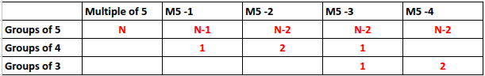
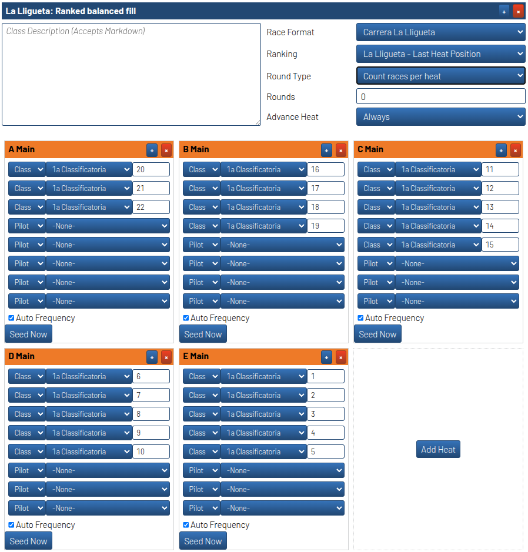

# La Lligueta Heat Generator Plugin: Balanced Ranking

This plugin is a heat generator for RotorHazard, designed to create balanced heats for ladder-style racing events. It ensures that pilots are distributed across heats in a ranked and balanced manner, optimizing the competition structure.

It's designed to follow the rulebook of [La Lligueta](https://lalligueta.com/) where we prioritze heats of 5 pilots when possible, then of 4 and then of 3. Full algorithm is detailed later.

## How It Works

The plugin uses the following logic to generate heats:

1. **Input Parameters**: The plugin takes several input parameters, such as the number of available seats per heat, the total number of pilots, and an optional seed offset.
2. **Pilot Distribution**: Pilots are ranked and distributed inversely across heats to ensure balance. The number of heats is calculated based on the total pilots and available seats.
3. **Heat Creation**: Each heat is assigned a unique name (e.g., "A Main", "B Main") and populated with pilots based on the calculated distribution.
4. **Fallbacks**: If no specific class or results are provided, the plugin defaults to using all available pilots.

The plugin ensures that heats are filled in descending order of pilot ranking, creating a fair and competitive ladder structure.

## How to Use

1. **Installation**: Place the plugin folder (`rh_heatgenerator_balanced_ranking`) in the `plugins` directory of your RotorHazard server.
2. **Initialization**: The plugin automatically registers itself when the server starts. It listens for the `HEAT_GENERATOR_INITIALIZE` event to register its heat generation logic.
3. **Configuration**: Use the RotorHazard UI to configure the heat generator. The following fields are available:
   - `total_pilots`: Maximum pilots in the class (used only with input class). Defaults to same number of pilots of input class or all pilots in DB
   - `seed_offset`: Starting rank for seeding pilots.
   - `suffix`: Suffix for heat titles (default is "Main").
4. **Generate Heats**: Select the "Ranked balanced fill" option in the heat generator menu and provide the necessary parameters. The plugin will generate heats based on the input.

## Logic Explanation

The core logic of the plugin is implemented in the `generateBalancedLadder` function:

1. **Calculate Total Pilots**: The `getTotalPilots` function determines the total number of pilots based on the input class or all available pilots.
2. **Determine Heat Structure**:
   - Using generate_heat_sizes we generate the heat sizes, that can be 5, 4 or 3. Prioritizing groups of 5, then of 4 and finally of 3. Groups with less pilots will be for the last ones of the classification and the first ones to fly.
   So for a race of 25 pilots we would have 5 groups of 4, and from there to 21 we would follow the following algorithm:
   

   And when we are back to 20, it's all groups of 5 and from there same algorithm.
3. **Create Heats**:
   - Assign a unique name to each heat using letters (e.g., "A", "B") and the provided suffix.
   - Populate each heat with pilots, following the distribution given in the previous step.
4. **Return Heats**: The generated heats are returned as a list of `HeatPlan` objects, ready to be used by the RotorHazard system.

### Example
For a race of 22 pilots this would be the output

This plugin is ideal for ladder-style events where balanced competition is essential. It ensures that pilots are distributed fairly, creating an engaging and competitive racing experience.
